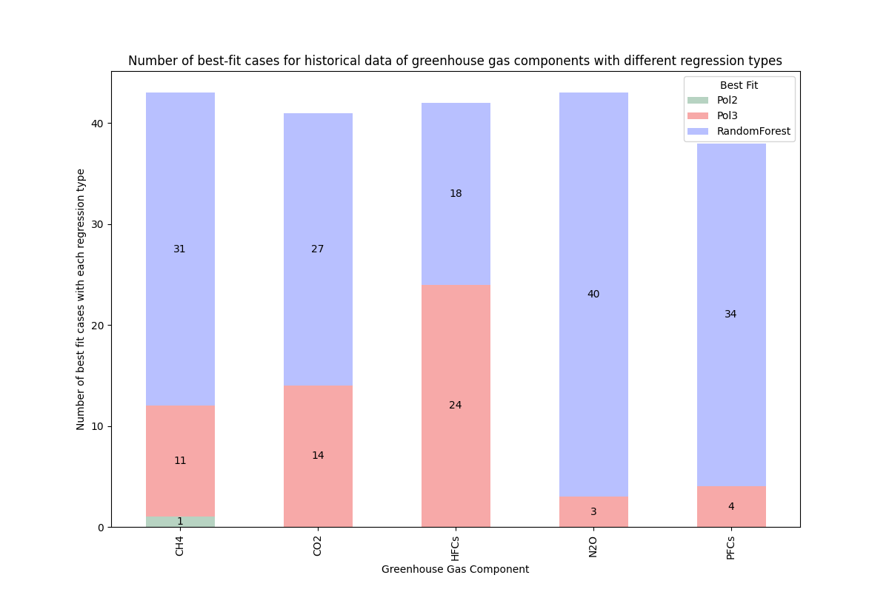
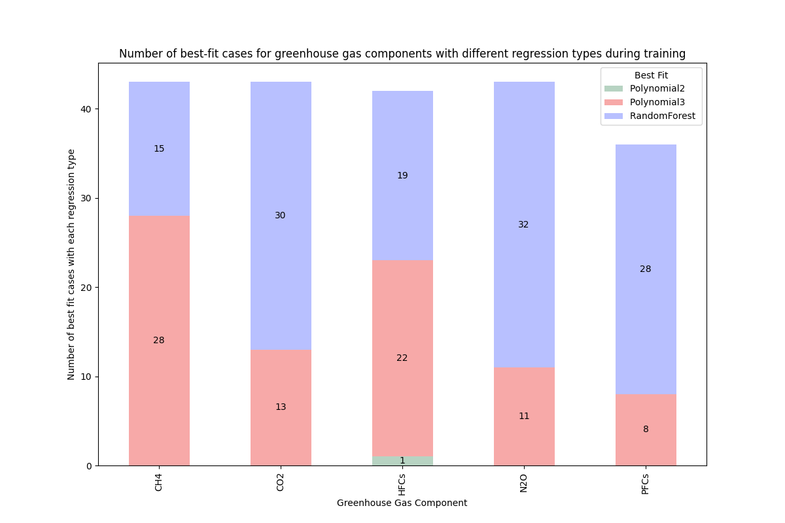
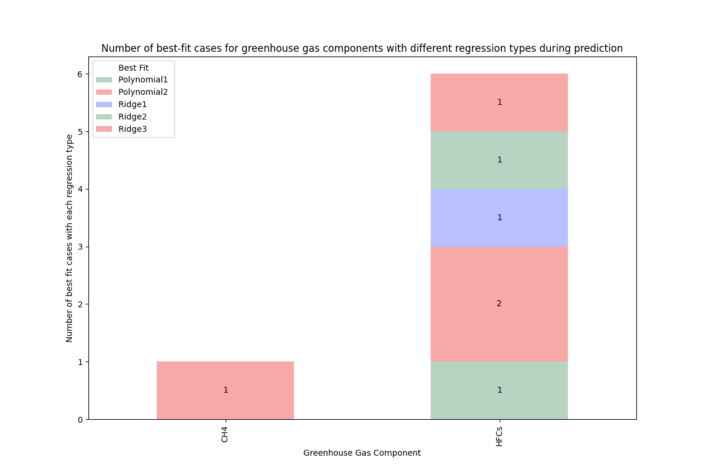

# Mini Project: Evaluation of regression methods for modeling and prediction of a greenhouse gas emissions dataset

## Brief

Polynomial (grades 1-3), Ridge (1-3) and Random Forest regressions were implemented on a dataset containing annual data of greenhouse gases (GHGs) for different countries between the years 1990-2014.

Python was used, alongside Pandas, NumPy, Scikit-Learn and Matplotlib.

## About the dataset

### Link

Kaggle, International Greenhouse Gas Emissions Dataset: https://www.kaggle.com/datasets/unitednations/international-greenhouse-gas-emissions/data 

### Data entries:
- Countries/regions: 42 individual countries and an additional register for the European Union (43 in total)
- Greenhouse Gas Components: CO2, HFCs, CH4, NF3, N2O, PFCs, SF6, HFCs/PFCs mix.
- Years: 1990-2014

### Initial data exploration:
- Small dataset: 24 entries (one per year) per component in each country/region. Could potentially impact data prediction results due to the limited data entries.
- The following GHGs had very few, or none, data entries in many countries, and were considered unfit for modeling and prediction: NF3, SF6, HFCs/PFCs mix.
- Computed annual percentage of each GHG, based on the total composition of the country's emissions.
- Computed the overall increase or decrease of each GHG over time.

## Objectives

- Model the historical data, and predict future data, for CO2, HFCs, CH4, N2O and PFCs, using different regressions.
- Evaluate the performance of each regression for modeling and prediction to determine the best fit for this dataset.

## Regression benchmarking

### Regression selection and cross validation strategy

The following regressions were implemented:
    - Polynomial (grades 1-3)
    - Ridge (with polynomial grades 1-3)
    - Random Forest

Polynomial regressions were chosen as the main option to fit the data, Ridge was implemented to test if it could reduce the overfitting of the model during prediction, and Random Forest to test if a more complex model was needed.

Additionally, for prediction a Time-Series Cross Validation strategy was used, given that the dataset is time-ordered. Cross validation with 2-5 folds were tested in the dataset. The relatively best performance was obtained with 2 folds, which was attributed to the size of the dataset.

### Modeling and prediction strategy

GHGs were modeled and predicted based on individual countries/regions as they were provided in the dataset. This was chosen to prioritize equal data entries among all subsets, as the only reference variable in the dataset was time. Otherwise, modeling and prediction based on aggregated regions or continents would require additional variables to consider country differences that could impact the results, which is not possible in this case.

## Results

After the regressions were implemented, the R2 scores were computed to compare their performance. The best regression fit (R2 closest to 1) was determined for each given GHG, per country. The total number of evaluations in which each regression achieved the best fit was then counted to determine the best overall performance.

Random Forest outperformed the other regressions in historical data modeling and during training (Figures 1-2), but all regressions performed badly on prediction as only a small number of cases had a strong fit (Figure 3). This aligned with the expected result, as the size of the dataset (and thus the folds for cross-validation) may have impacted the prediction. Lastly, Ridge had similar R2 scores to their respective polynomial regressions, indicating little impact on the results.

